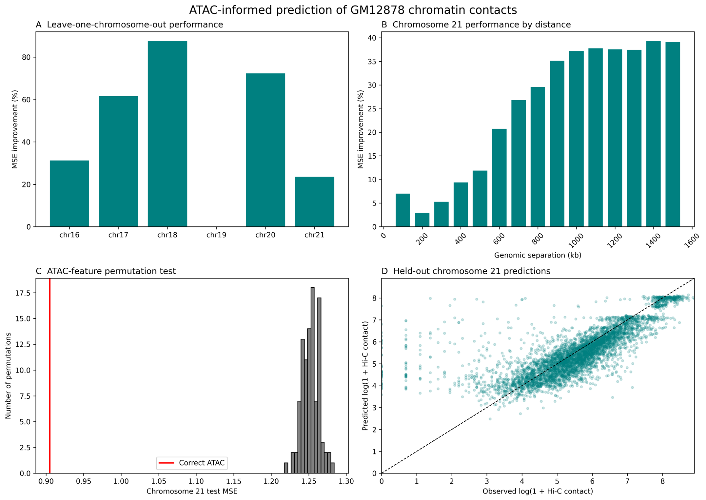
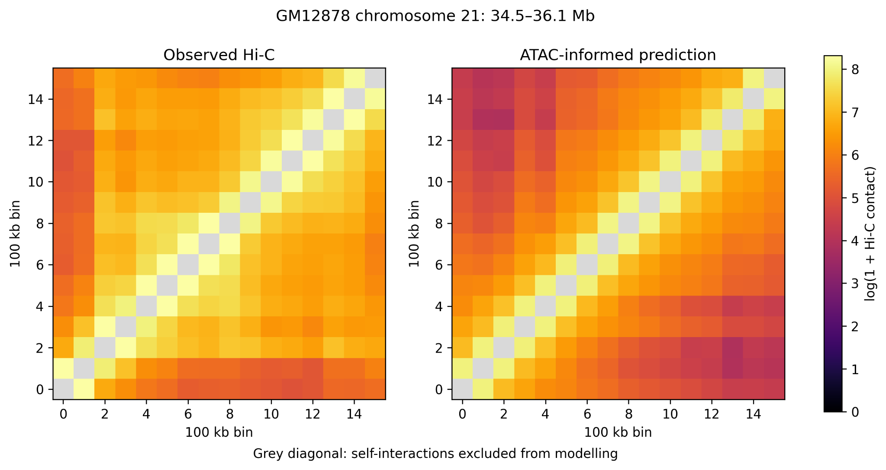

# ATAC-informed prediction of Hi-C contacts in GM12878 cells

This project investigates whether chromatin accessibility measured by ATAC-seq can improve predictions of short-range chromatin contacts measured by Hi-C. Using publicly available ENCODE data from GM12878 cells, I trained a gradient-boosted regression model to predict contact intensity between pairs of genomic regions and evaluated whether it performed better than a model based on genomic distance alone.

## Abstract

The three-dimensional organisation of the genome influences gene regulation, but assays such as Hi-C are more demanding than one-dimensional measurements of chromatin accessibility. I therefore asked whether ATAC-seq signal contains information that can help predict local Hi-C contact strength.

ATAC-seq and Hi-C data from the GM12878 lymphoblastoid cell line were divided into 100 kb genomic bins. Pairs of bins separated by 100 kb to 1.5 Mb were represented using genomic distance and five features derived from their ATAC-seq signals. A gradient-boosted regression model was trained on chromosomes 16–19, tuned on chromosome 20, and evaluated on the long arm of chromosome 21, which was held out from both training and model selection.

On chromosome 21, the ATAC-informed model reduced mean squared error by 23.59% and mean absolute error by 27.92% relative to a distance-only baseline. Predicted and observed contact strengths were positively correlated (Pearson *r* = 0.739; Spearman *ρ* = 0.816). Shuffling the ATAC-derived features significantly reduced performance in a permutation test (*p* = 0.0099), supporting the conclusion that the accessibility features contributed information beyond genomic distance. These results provide a proof of concept that ATAC-seq can help predict short-range variation in chromatin contact intensity, although broader biological validation is required.

## Biological question

Hi-C contact frequency depends strongly on the genomic distance between two regions: nearby loci usually interact more often than distant loci. A useful ATAC-based model must therefore do more than reproduce this distance-decay relationship. The central question in this project was:

> Does chromatin accessibility improve the prediction of short-range Hi-C contact strength beyond what can already be explained by genomic distance?

## Data

Both datasets were obtained from the ENCODE Project and use the GM12878 cell line:

- **ATAC-seq:** [ENCFF667MDI](https://www.encodeproject.org/files/ENCFF667MDI/) from experiment [ENCSR637XSC](https://www.encodeproject.org/experiments/ENCSR637XSC/)
- **Hi-C:** [ENCFF916GWS](https://www.encodeproject.org/files/ENCFF916GWS/) from experiment [ENCSR830NVY](https://www.encodeproject.org/experiments/ENCSR830NVY/)
- **Genome assembly:** hg38
- **Resolution:** 100 kb
- **Chromosomes analysed:** 16–21
- **Interaction range:** 100 kb to 1.5 Mb

The large raw `.bigWig` and `.hic` files are not stored in this repository. The notebook downloads them directly from ENCODE when the analysis is run.

## Methods

### Data preparation

ATAC-seq signal was averaged within 100 kb bins. Hi-C contact matrices were extracted at the same resolution, and missing or non-finite values were converted to zero. The analysis used observed, unnormalised Hi-C contacts because KR-normalised values were unavailable through the selected file at this resolution.

The short arm of chromosome 21 contains poorly mapped regions, so the primary chromosome 21 evaluation was restricted to bins beginning at 13 Mb. Self-interactions on the matrix diagonal were excluded, and only pairs separated by 1–15 bins were modelled.

### Features and target

Each example represents a pair of genomic bins. The six input features were:

1. Genomic separation in 100 kb bins
2. Lower ATAC-seq signal of the two bins
3. Higher ATAC-seq signal of the two bins
4. Mean ATAC-seq signal
5. Absolute difference in ATAC-seq signal
6. Product of the two ATAC-seq signals

ATAC-seq values were transformed with `log1p`, and the prediction target was `log1p`-transformed Hi-C contact intensity.

### Model and data split

The final model was a scikit-learn `HistGradientBoostingRegressor`. To reduce leakage between correlated genomic regions, entire chromosomes—not randomly selected bin pairs—were assigned to each stage:

- **Training:** chromosomes 16–19
- **Model selection:** chromosome 20
- **Final test:** chromosome 21 long arm

Hyperparameters were selected using chromosome 20 only. Chromosome 21 was evaluated after model selection and was not used for training or tuning.

### Baseline and evaluation

The baseline predicts the mean training-set contact intensity for each genomic separation. This provides a more meaningful comparison than a single global mean because it captures the strong distance-dependent decay of Hi-C contacts.

Performance was assessed using mean squared error (MSE), mean absolute error (MAE), Pearson correlation, and Spearman correlation. A permutation test was also performed by preserving genomic distance while shuffling the five ATAC-derived features, thereby breaking their relationship with the target.

## Results

### Held-out chromosome 21

| Metric | Result |
|---|---:|
| Distance-baseline MSE | 1.1878 |
| ATAC-informed model MSE | 0.9076 |
| MSE improvement | **23.59%** |
| Distance-baseline MAE | 0.7908 |
| ATAC-informed model MAE | 0.5700 |
| MAE improvement | **27.92%** |
| Pearson correlation | **0.739** |
| Spearman correlation | **0.816** |
| Permutation-test *p*-value | **0.0099** |

The model outperformed the distance-only baseline on both error measures. Its positive Pearson and Spearman correlations indicate that it captured substantial variation in contact strength, although the predictions remained imperfect.

### Contribution of ATAC-seq features

The observed chromosome 21 MSE was 0.9076. After the ATAC-derived features were shuffled, the mean MSE increased to approximately 1.25. None of the 100 shuffled runs performed as well as the correctly paired ATAC features, producing a permutation *p*-value of 0.0099 using the standard plus-one correction. This suggests that the model was using biologically relevant accessibility information rather than genomic distance alone.

### Performance across genomic distances

The ATAC-informed model improved over the baseline across all tested separations from 100 kb to 1.5 Mb. The improvement was modest at the shortest distances and generally increased at larger separations, reaching approximately 39% at 1.4–1.5 Mb. One interpretation is that genomic distance already explains much of the contact pattern between very close regions, leaving more additional information for accessibility features to contribute at longer distances within the analysed range.

### Exploratory chromosome holdouts

In an additional leave-one-chromosome-out analysis, the model improved MSE on all six analysed chromosomes, with a mean improvement of 46.06%. Results varied considerably between chromosomes, from 0.03% improvement on chromosome 19 to 87.63% on chromosome 18. This analysis supports the general pattern but should be treated as exploratory because chromosome 20 had already been used during the original model-selection process.

## Figures

### Figure 1 | Summary of ATAC-informed contact prediction

**(A)** Improvement in MSE over a distance-only baseline when each chromosome was held out in turn. **(B)** Chromosome 21 MSE improvement at genomic separations from 100 kb to 1.5 Mb. **(C)** Permutation distribution obtained after shuffling the ATAC-derived features while preserving genomic distance; the red line marks the MSE obtained with the correctly paired features. **(D)** Predicted versus observed `log1p` Hi-C contact intensity for held-out chromosome 21 pairs. The dashed line represents perfect agreement.

### Figure 2 | Observed and predicted contacts within chromosome 21

Observed Hi-C contacts (left) and ATAC-informed predictions (right) across a 1.6 Mb region of GM12878 chromosome 21 at 100 kb resolution. Both maps use the same colour scale, with brighter colours representing stronger `log1p` contact intensity. Grey diagonal cells are self-interactions excluded from modelling. The prediction reproduces the broad distance-dependent structure of the observed map, while differences in local intensity show where the model remains incomplete. This contact-rich window was selected for visualisation and is not an independent performance test.

## Interpretation

The results support a focused conclusion: within this dataset and modelling framework, ATAC-seq features contain predictive information about short-range Hi-C contact strength beyond genomic distance. They do not show that ATAC-seq can reconstruct a complete Hi-C map, replace a Hi-C experiment, or establish a causal relationship between chromatin accessibility and three-dimensional genome organisation.

The predicted maps are smoother than the observed maps because the model uses a small set of accessibility and distance features. It can learn broad trends associated with open chromatin but cannot represent every factor that shapes chromatin contacts, such as CTCF orientation, cohesin binding, compartment identity, replication timing, sequence context, or experimental noise.

## Limitations and future work

This study has several important limitations:

- Only one cell line and six chromosomes were analysed.
- The ATAC-seq and Hi-C files may differ in biological replicate or experimental preparation.
- Hi-C contacts were unnormalised in the final analysis.
- Genomic bin pairs are spatially correlated and should not be treated as completely independent biological observations.
- The 100 kb resolution captures broad contact patterns but not fine-scale loops or regulatory interactions.
- The analysis is limited to contacts separated by no more than 1.5 Mb.
- The contact-rich region in Figure 2 was selected for illustration.
- The exploratory leave-one-chromosome-out analysis is not fully independent of model selection.

Useful next steps would include testing additional cell lines and replicates, analysing all autosomes, comparing multiple Hi-C normalisation methods, adding CTCF and histone-mark features, evaluating compartment- or TAD-aware baselines, and validating on a completely external dataset.

## Reproducing the analysis

The notebook is designed to run in Google Colab.

1. Open `notebooks/ATAC_to_HiC_GM12878.ipynb` in Colab.
2. Use **Runtime → Run all**.
3. Allow time for the ENCODE files to download and for the six chromosome matrices to be extracted.
4. Run the notebook in order to reproduce the processed arrays, trained model, evaluation tables, statistical test, and figures.

The ATAC-seq bigWig is approximately 1.3 GB, so sufficient Colab disk space and a stable connection are required. Python dependencies are listed in `requirements.txt`. The saved model was produced with scikit-learn 1.6.1, which is pinned to avoid model-compatibility warnings.

## Software

The analysis uses Python with NumPy, pandas, SciPy, scikit-learn, Matplotlib, pyBigWig, hic-straw, and joblib.

## Licence

The project code is released under the MIT License. ENCODE data remain subject to their original data-use terms.
