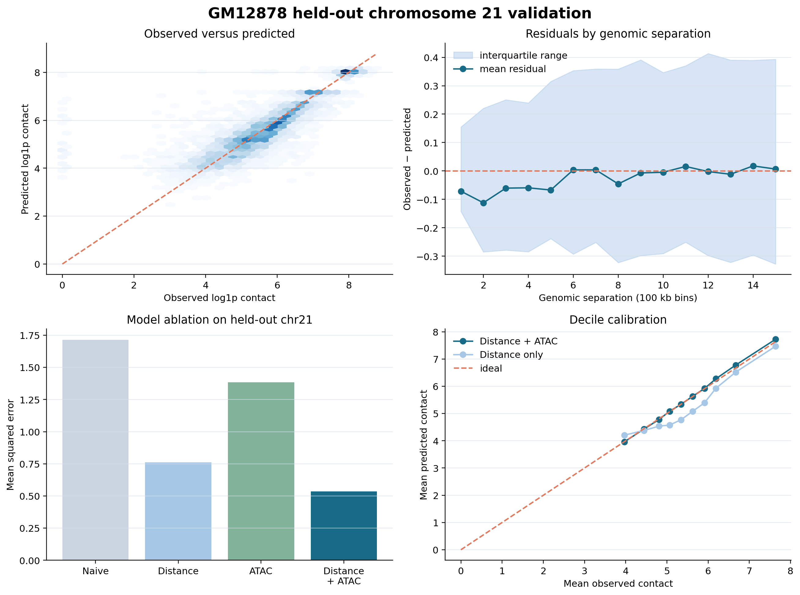

# ATAC-Informed Prediction of Short-Range Hi-C Contacts in GM12878 Cells

## Abstract

Chromatin accessibility and three-dimensional genome organisation are known to be related, yet genomic distance remains by far the strongest predictor of contact frequency in Hi-C data. This study asks a narrower and more tractable question: does local ATAC-seq signal improve prediction of short-range cis Hi-C contact strength beyond what genomic distance alone can explain? Matched GM12878 ATAC-seq and Hi-C datasets were obtained from ENCODE and summarised into 100 kb genomic bins. Hi-C contacts were balanced using VC_SQRT normalisation, and analysis was restricted to intrachromosomal pairs separated by 100 kb to 1.5 Mb. A simple distance-dependent baseline was compared against a gradient-boosted model that combined genomic distance with several ATAC-derived features. Chromosomes were kept strictly separate across training, model selection and testing throughout, in order to guard against genomic data leakage. On an independent chromosome 21 test region, the inclusion of ATAC features reduced mean squared error by 29.6% and mean absolute error by 29.7% relative to the distance-only baseline. The combined model also outperformed the baseline on every chromosome examined in a subsequent nested validation spanning chromosomes 16 through 21. Taken together, these results support a modest but well-supported conclusion: local chromatin accessibility carries predictive information about short-range GM12878 contact strength that is not captured by genomic distance alone.

## 1. Introduction

The folding of chromatin into loops, domains and compartments is thought to be linked to where the genome is accessible to regulatory machinery, but the strength of this relationship at short genomic ranges is not settled. Genomic distance dominates contact frequency in Hi-C experiments almost by definition — two loci close together on the linear genome are simply more likely to collide in three-dimensional space than two loci far apart. Any claim that a secondary signal, such as chromatin accessibility measured by ATAC-seq, adds meaningful predictive power has to be evaluated against this strong and well-understood baseline.

This project therefore takes a deliberately narrow approach. Rather than attempting to build a comprehensive model of genome folding, it asks whether a small set of features derived from local ATAC-seq signal can improve on a distance-only baseline for short-range contacts in a single, well-characterised cell line. The scope is intentionally limited so that the resulting claims can be tightly supported by the data: one cell line (GM12878), one resolution (100 kb), and one range of genomic separations (100 kb to 1.5 Mb).

## 2. Data

Matched GRCh38 GM12878 ATAC-seq and Hi-C datasets were obtained from ENCODE. The Hi-C matrix was extracted at 100 kb resolution and balanced using VC_SQRT normalisation, and the ATAC-seq signal p-value track was averaged into the same genomic bins. A K562 ATAC-seq and Hi-C dataset was also retained in the project's data manifest for a planned cross-cell-line comparison, but it was not used in producing any of the validated results reported here.

Chromosomes containing missing or non-finite values were excluded during data validation, and every processed Hi-C matrix was checked for consistent dimensions, non-negative entries and symmetry before use. Both ATAC and Hi-C values were transformed with a log1p transformation prior to modelling, which is a standard way of stabilising variance in signal that spans several orders of magnitude.

## 3. Study Design

The central analysis used a strict chromosome-level split, chosen specifically to avoid the kind of leakage that can arise when nearby genomic bins end up in both the training and test sets. Chromosomes 16 through 19 were used to fit candidate models. Chromosome 20 was reserved for choosing model complexity and regularisation. Chromosome 21's long arm was held out entirely and used only once, as a final and fully independent test of the selected model. This region contained 4,935 genomic pairs.

For every pair of loci, five features were constructed: the genomic separation between the two bins, the lower and higher of the two ATAC signal values at the pair, the mean of the two ATAC values, the absolute difference between them, and their product. Features were built so that swapping the order of the two loci in a pair would not change its representation, which matters because contact strength between two bins has no natural directionality.

The modelling approach itself was a gradient-boosted regression tree, specifically a histogram-based gradient boosting regressor, tuned with seven maximum leaf nodes, an L2 regularisation strength of 0.1, a learning rate of 0.05, and 250 boosting iterations. These settings were chosen using chromosome 20 alone, before the model was ever exposed to chromosome 21.

## 4. Results

### 4.1 ATAC features improve prediction on the independent chromosome 21 test

The distance-only baseline captured a large part of the expected distance-decay relationship, which was expected given how strongly contact frequency depends on genomic separation. Adding the ATAC-derived features nonetheless improved every metric that was assessed. Mean squared error fell from 0.7602 to 0.5355, and mean absolute error fell from 0.6351 to 0.4463 — reductions of 29.6% and 29.7% respectively. R-squared rose from 0.535 to 0.672, Pearson correlation rose from 0.766 to 0.821, and Spearman correlation rose from 0.788 to 0.858.

The combined model was also well calibrated on this held-out region: the calibration slope was 0.964 and the mean residual was −0.027 in log1p contact units, indicating little systematic bias across the test set. A residual-by-distance analysis showed that the mean residual stayed close to zero across most genomic separations, with a modest tendency toward over-prediction at the very shortest distances examined.

**Figure 1. Validation of ATAC-informed contact prediction on held-out chromosome 21.** The top left panel shows observed against predicted log1p contact strengths for the distance-plus-ATAC model, with colour intensity representing the density of genomic pairs and a dashed line marking perfect agreement. The top right panel shows the mean residual and interquartile range at each genomic separation, which stayed close to zero across most of the range examined. The bottom left panel shows the model ablation, comparing mean squared error across the naive mean, distance-only, ATAC-only and combined models; distance was clearly the stronger individual predictor, but the lowest error was obtained only when distance and ATAC were combined. The bottom right panel shows decile calibration for the distance-only and combined models, with the distance-plus-ATAC predictions tracking the ideal calibration line more closely across most of the observed contact range.

### 4.2 The model recovers broad contact structure, though not fine-scale detail

Comparing observed and predicted contact maps across a 1.6 Mb window of the held-out chromosome 21 region showed that the predicted map reproduced the principal distance-dependent pattern: contacts were strongest near the diagonal and weakened with increasing genomic separation, and broad differences in contact strength across the window were preserved. The predicted map was, however, visibly smoother than the observed Hi-C data and did not reproduce every local fluctuation present in the real measurements. This is an expected consequence of using a model built from only two loci's ATAC signal and their genomic separation, and the contact map comparison should be read as a qualitative illustration of model behaviour rather than as evidence that fine-scale chromatin structure has been fully recovered. The quantitative metrics reported above, which cover the entire held-out test region, remain the primary basis for assessing performance.

**Figure 2. Observed and predicted contact structure within a held-out chromosome 21 window.** The left panel shows observed VC_SQRT-balanced Hi-C contact strengths across chr21:34.5–36.1 Mb. The right panel shows contact strengths predicted by the fixed distance-plus-ATAC model for the same genomic pairs, expressed as log1p contact strength in 100 kb bins on the same colour scale as the observed map, allowing direct visual comparison between the two. Grey diagonal cells represent self-interactions, which were excluded from both model fitting and evaluation. The predicted map recovers the broad distance-dependent contact pattern seen in the observed data but is noticeably smoother, consistent with the model's reliance on only genomic distance and two-locus ATAC signal rather than any finer-scale structural information.

### 4.3 Distance and accessibility provide complementary rather than redundant information

An ablation analysis compared four models: a naive baseline that always predicted the training-set mean contact strength, a distance-only model, an ATAC-only model, and the combined distance-plus-ATAC model. ATAC signal on its own performed considerably worse than genomic distance (MSE of 1.383 versus 0.760, Pearson correlation of 0.393 versus 0.766), confirming that distance remains the dominant single predictor of short-range contact strength. Nevertheless, the combined model outperformed both individual-feature models by a substantial margin, reaching an MSE of 0.536 and a Pearson correlation of 0.821. This pattern — a weak individual predictor still adding real value once combined with a strong one — is consistent with the biological interpretation that genomic distance describes the broad decay in contact frequency with separation, while local chromatin accessibility contributes finer-grained information distinguishing pairs at similar separations from one another.

### 4.4 The improvement generalises beyond chromosome 21

Because a single held-out chromosome could in principle be an unrepresentative or favourable test case, a nested chromosome-level validation was carried out across chromosomes 16 through 21, holding out each chromosome in turn while selecting model settings on a separate validation chromosome each time. The combined model improved on the distance-only baseline for all six chromosomes tested. The median reduction in MSE across chromosomes was 45.8%, and the median reduction in MAE was 30.0%. The smallest improvement was observed on chromosome 19, where MSE fell by 9.0%. The size of the improvement varied noticeably from chromosome to chromosome, so the median values should not be read as a genome-wide estimate of expected benefit — but the consistent direction of the effect across six independently held-out chromosomes is good evidence that the chromosome 21 result was not a fluke of that particular test split.

## 5. Interpretation

Together, these results indicate that chromatin accessibility contributes information about short-range Hi-C contact strength that genomic distance alone does not capture. Distance remains the dominant single predictor, and ATAC signal by itself is a comparatively weak one, but the two combine in a way that meaningfully improves prediction accuracy — consistent with the two sources of information being complementary rather than substitutable.

It is worth being explicit about what this project does not show. It does not demonstrate that ATAC-seq could substitute for Hi-C experimentally, and it does not establish that chromatin accessibility causally strengthens genomic contacts — the analysis is predictive, not mechanistic. The model was trained and evaluated within a single cell line, at a single resolution, and over a bounded range of short genomic separations. Any conclusions drawn from this work should be read as specific to short-range cis contact prediction in GM12878 cells under the particular conditions tested here, rather than as a general statement about chromatin accessibility and genome folding.

## 6. Methods Summary

Pairwise features were constructed separately for each chromosome, covering bins one to fifteen positions apart (corresponding to the 100 kb–1.5 Mb range), and pairs involving bins without Hi-C coverage were excluded. The distance baseline predicted, for each discrete genomic separation, the mean contact strength observed in the training data at that separation. Candidate gradient-boosted models were trained on chromosomes 16 through 19 and ranked by their MSE on chromosome 20; the best-ranked configuration was then evaluated exactly once on chromosome 21. Because the modelled contact target after transformation is non-negative, all predictions were clipped at zero.

Model performance was assessed using mean squared error, mean absolute error, R-squared, Pearson correlation and Spearman correlation, supplemented by calibration analysis, residual-by-distance analysis, and the model ablation described above. The nested chromosome-level validation followed the same logic as the primary analysis, always keeping the chromosome used for final testing separate from the chromosome used to select model settings.

## 7. Limitations

Several limitations should be kept in mind when interpreting this work. The validated dataset covers only chromosomes 16 through 21 of a single cell line, GM12878, and the analysis is restricted to 100 kb bins and separations of no more than 1.5 Mb. Because nearby genomic pairs are not independent of one another, the individual pair-level observations used in model fitting and evaluation should not be treated as independent biological replicates. ATAC-derived features may also be capturing technical artefacts or other genomic covariates rather than accessibility itself, and — as noted above — predictive improvement is not evidence of a causal relationship between accessibility and contact formation. A planned extension to the remaining GM12878 autosomes, and a further exploratory comparison against K562 cells, have not yet been carried out and should not be treated as completed or successful until their outputs have actually been generated and reviewed.

## 8. Data Sources

All datasets used were GRCh38 ENCODE releases: GM12878 Hi-C data (accession ENCFF916GWS), GM12878 ATAC-seq signal p-value data (accession ENCFF667MDI), and, for the planned but not-yet-executed cross-cell-line comparison, K562 Hi-C data (accession ENCFF080DPJ) and K562 ATAC-seq data (accession ENCFF600FDO). File accessions and checksums are recorded in the project's dataset configuration, and all source data remain subject to ENCODE's data-use policies.
